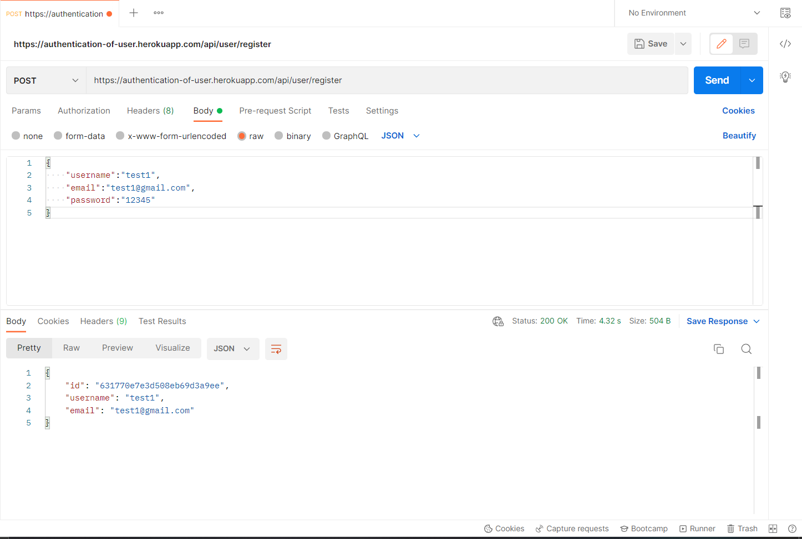
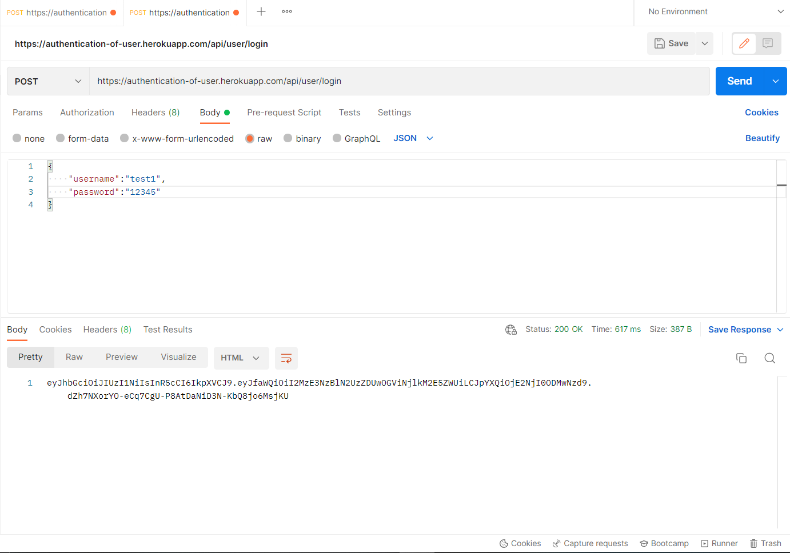
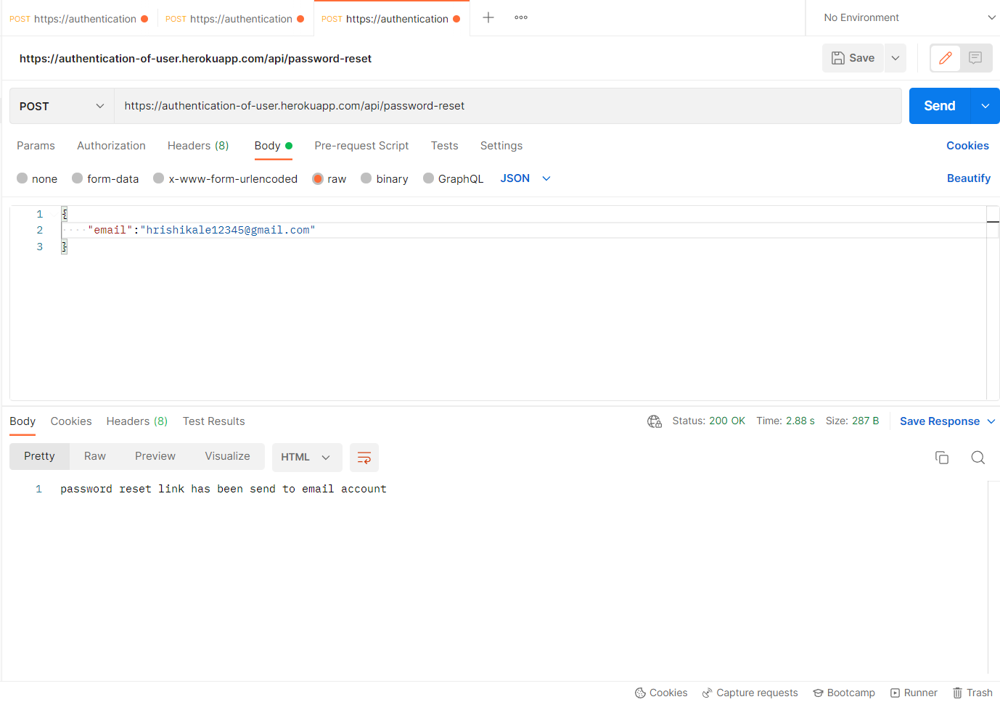
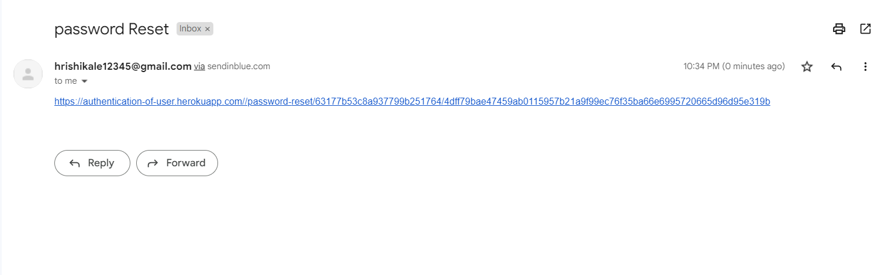
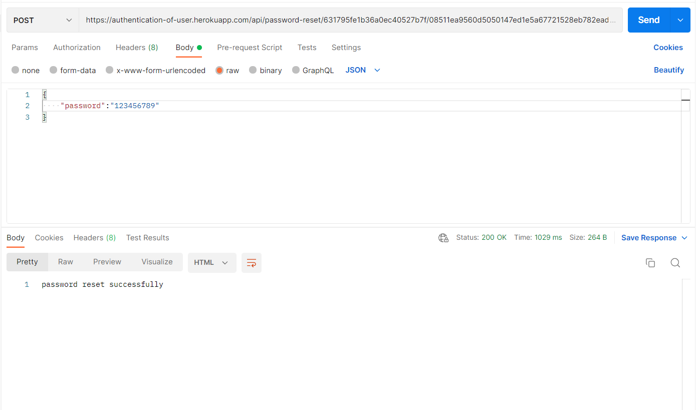
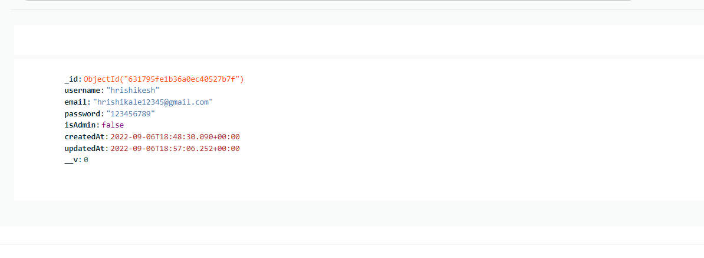

# User Authentication and Authorization

Crated this backend using nodejs,mongoose and expressjs and jwt 
with this api you can perform Authentication and Authorization of user,
in this api user can reset password he or she will receive password reset link,
for this i have use nodemailer, used JOI library for user validation 


## API Reference
to use this link pls install postman.

#### post file
copy the link provide below, create post request and 
paste it in postman and follow the Screenshots that i have provided



```http
  post https://authentication-of-user.herokuapp.com/api/user/register
```


```http
  post https://authentication-of-user.herokuapp.com/api/user/login
```



```http
  post https://authentication-of-user.herokuapp.com/api/password-reset
```



```

## Deployment

App is deployed on heroku.

```

